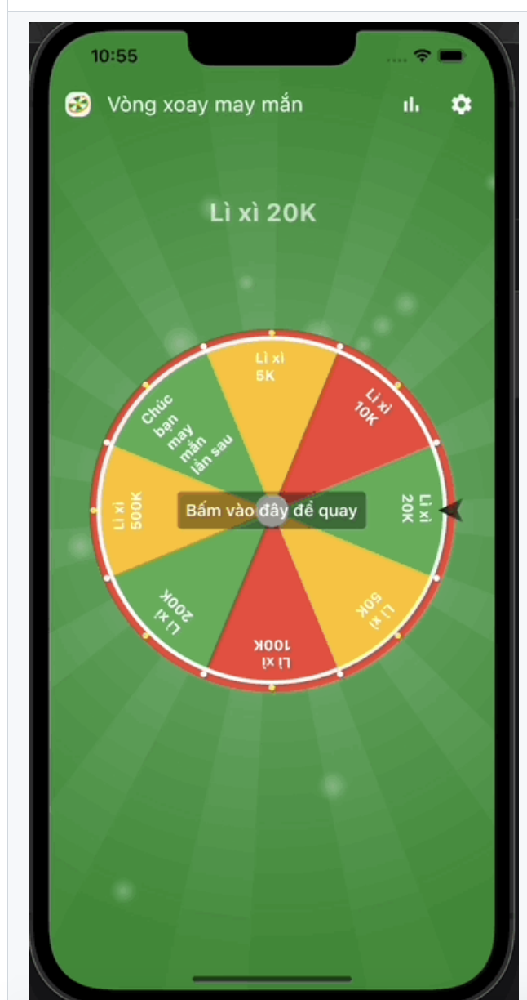
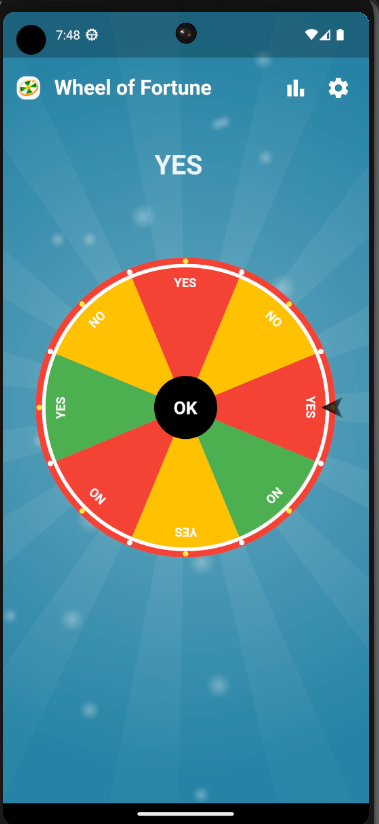
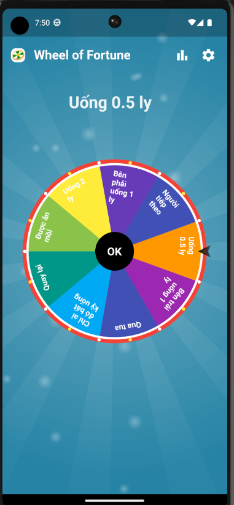
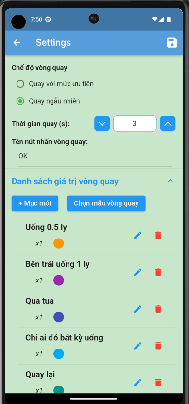
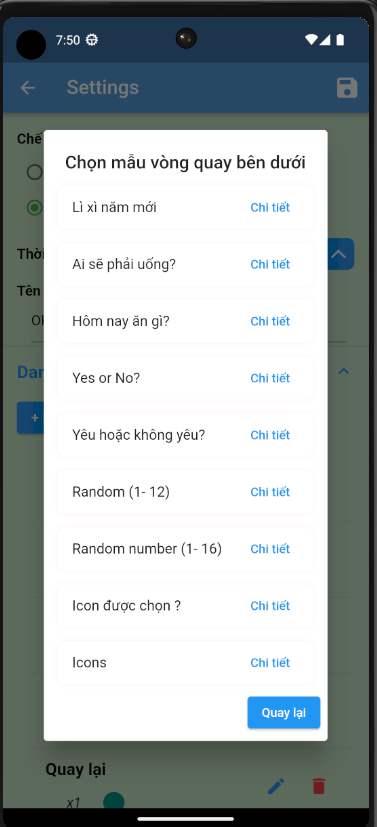

# Vòng quay may mắn  [INTERNSHIP]

## Design UI for Application Mobile:
- Frame UI used for screen size: **360 x 800** (Android Large)
- Link project Figma: [FIGMA UI MOBILE APP ANDROID](https://www.figma.com/file/lqdwZp0OjGFRpFLDHaf9zb/UI-Mobile-App-Rotation-Lucky?type=design&node-id=4%3A3&mode=design&t=hDINk7bhvHlMXdey-1)
## Report Latex for project on Overleaf:
- Link report project update according to project progress in Overleaf: [REPORT PROJECT](https://www.overleaf.com/read/vckmgnfhcnds)
- Link Trello manage project progress: [TRELLO PROJECT](https://trello.com/b/59avCLML/moblie-app-rotation-lucky)

## Demo
<!--  -->
<table align="center" style="margin: 0px auto;">
  <tr>
    <td></img></td>
    <td></img></td>
  </tr>
</table>

## Screenshot

<table align="center" style="margin: 0px auto;">
  <tr>
    <th>Setting Screen in Application</th>
    <th>Choose template in Application</th>
  </tr>
  <tr>
    <td></img></td>
    <td></img></td>
  </tr>
</table>

## Getting Started

This project is a starting point for a Flutter
[plug-in package](https://flutter.dev/developing-packages/),
a specialized package that includes platform-specific implementation code for
Android and/or iOS.

For help getting started with Flutter, view our
[online documentation](https://flutter.dev/docs), which offers tutorials,
samples, guidance on mobile development, and a full API reference.

